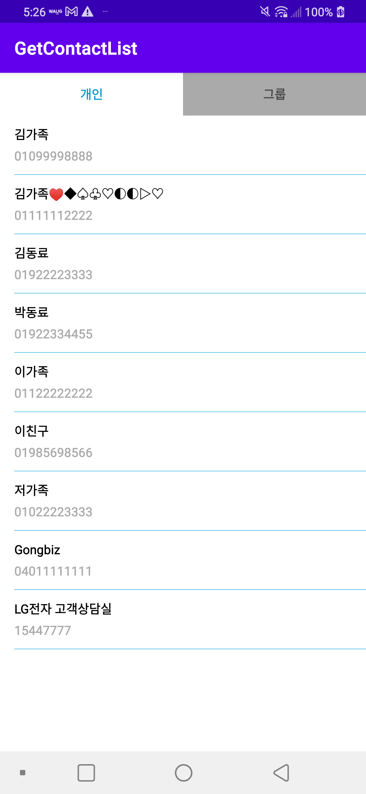
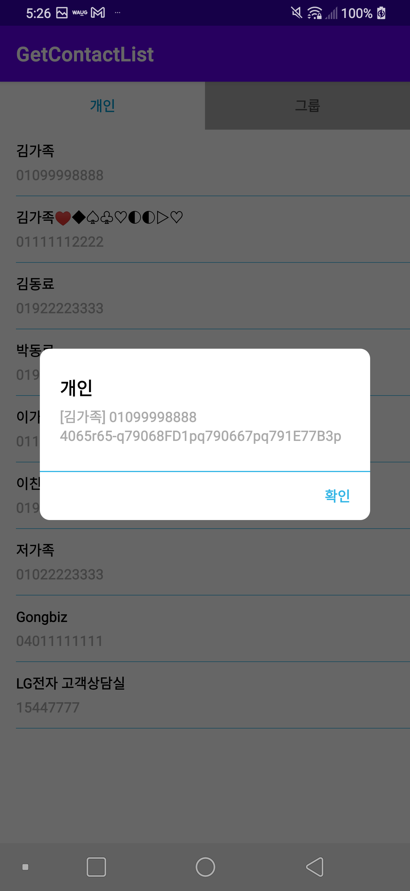
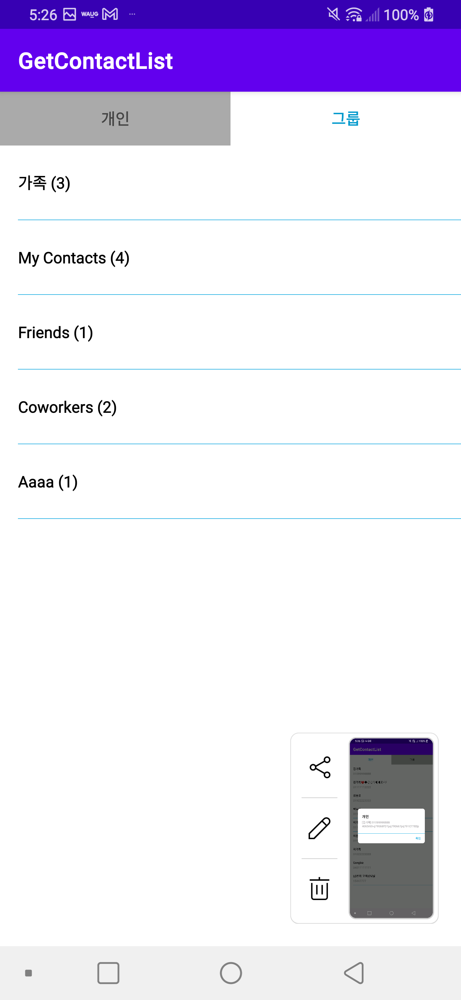
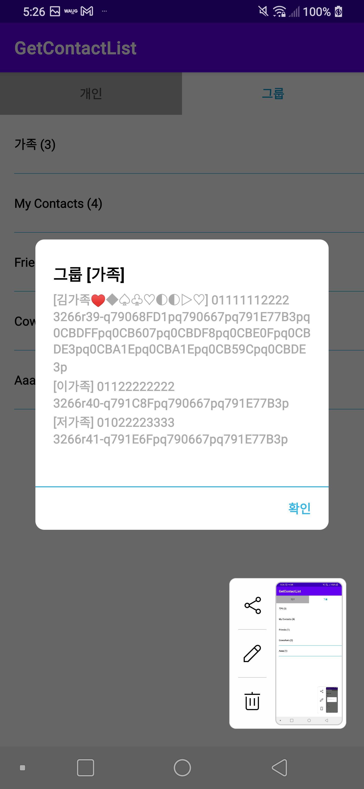

Contact List (Group) Sample
====================
연락처 목록 가져오기
그룹 연락처 목록 가져오기

Introduction
------------

Getting Started
---------------

Screenshots
-----------

Support
-------

- Stack Overflow:
  - https://developer.android.com/training/contacts-provider/retrieve-names?hl=ko

